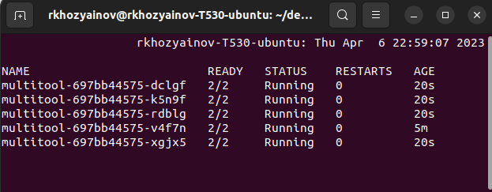

# Домашнее задание к занятию "Стратегии обновлений приложений"

### Цель задания

Выбрать и настроить стратегию обновления приложения

### Чеклист готовности к домашнему заданию

1. Кластер k8s

### Инструменты и дополнительные материалы, которые пригодятся для выполнения задания

1. [Документация Updating a Deployment](https://kubernetes.io/docs/concepts/workloads/controllers/deployment/#updating-a-deployment)
2. [Статья про стратегии обновлений](https://habr.com/ru/companies/flant/articles/471620/)

-----

### Задание 1. Выбрать стратегию обновления приложения и описать ваш выбор

1. Имеется приложение, состоящее из нескольких реплик, которое требуется обновить.
2. Ресурсы, выделенные для приложения ограничены и нет возможности увеличить
3. Запас по ресурсам в менее загруженный момент времени составляет 20%
4. Обновление мажорное, новые версии приложения не умеют работать со старыми
5. Какую стратегию обновления выберете и почему?

### Ответ  

По условию задания обновление мажорное и новые версии приложения не умеют работать со старыми и нет условия о доступности приложения  можно применить стратегию обновления - Recreate, требования о ресурсах будет выполнено так как сначала завершат работу все поды.  

Но представим себе что условие доступности хотя бы 1 старой версии все же присутствует, тогда можно применить RollingUpdate
с параметрами:  
maxSurge: 20%   выполняя условие о ресурсах  
maxUnavailable: количество реплик - 1  
Так же стоит учитывать:  
Kubernetes не учитывает завершенные поды при подсчете количества availableReplicas, которое должно быть между replicas - maxUnavailable и replicas + maxSurge. В результате вы можете заметить, что во время развертывания имеется больше модулей, чем ожидалось, и что общее количество ресурсов, потребляемых развертыванием, больше, чем replicas + maxSurge до terminationGracePeriodSecondsистечения срока действия завершающих модулей.
По информации из доки https://kubernetes.io/docs/concepts/workloads/controllers/deployment/  


### Задание 2. Обновить приложение

1. Создать deployment приложения с контейнерами nginx и multitool. Версию nginx взять 1.19. Кол-во реплик - 5
2. Обновить версию nginx в приложении до версии 1.20 сократив время обновления до минимума. Приложение должно быть доступно
3. Попытаться обновить nginx до версии 1.28, приложение должно оставаться доступным
4. Откатиться после неудачного обновления

### Ответ

Развернут кластер из 3 нод (1 контролплейн, 2 воркер) в ЯК с помощью терраформ, настроено подключение kubectl c хостовой машины   

По условию задания необходимо свести время обновления до минимума с учетом количества реплик 5 и доступности приложения. Ограничения по ресурсам нет.    
В соответствии с этим выбираем стратегию обновления - RollingUpdate с параметрами:  
maxUnavailable: 4  - максимальное количество недоступных подов 4, 1 будет доступен, что бы обеспечить доступность приложения  
maxSurge: 5  - максимально количество подов, на которое можно превысить значение replicas, что бы обеспечить минимальное время обновления  

[deployment](main/10-multitool-nginx.yaml)

Применяем deployment и обновляем до версии 1.20  
```bash
rkhozyainov@rkhozyainov-T530-ubuntu:~/devops/kuber-homeworks/3.4/main$ kubectl apply -f ./10-multitool-nginx.yaml 
deployment.apps/multitool created
rkhozyainov@rkhozyainov-T530-ubuntu:~/devops/kuber-homeworks/3.4/main$ kubectl set image deployment multitool nginx=nginx:1.20
deployment.apps/multitool image updated
```


Попытаемся обновить до версии 1.28
```bash
rkhozyainov@rkhozyainov-T530-ubuntu:~/devops/kuber-homeworks/3.4/main$ kubectl set image deployment multitool nginx=nginx:1.28
deployment.apps/multitool image updated
```


Откатываемся 
```bash
rkhozyainov@rkhozyainov-T530-ubuntu:~/devops/kuber-homeworks/3.4/main$ kubectl rollout undo deployment multitool 
deployment.apps/multitool rolled back
```

